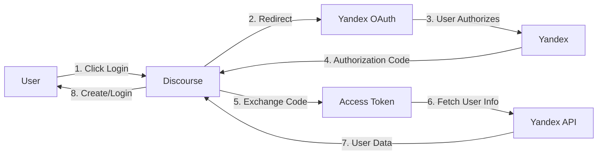

<div align="center">

# 🔐 Yandex ID Authentication for Discourse

[](https://www.discourse.org/)
[](https://www.ruby-lang.org/)
[](https://oauth.net/2/)
[](LICENSE)

### 🌍 Languages / Языки

[](README.md)
[](README_RU.md)

---

**OAuth2 authentication plugin for Discourse using Yandex ID**

[Features](#-features) • [Installation](#-installation) • [Configuration](#️-configuration) • [Troubleshooting](#-troubleshooting) • [Documentation](#-documentation)

</div>

---

## ⚡ Features

<table>
<tr>
<td width="50%">

### 🔐 Security
- **OAuth 2.0** authorization code flow
- Client secret stored securely
- HTTPS required for all endpoints
- CSRF protection via `state` parameter
- No passwords stored locally

</td>
<td width="50%">

### 🎨 User Experience
- One-click authentication with Yandex
- Automatic user creation
- Account linking by email
- Avatar import from Yandex
- Seamless login experience

</td>
</tr>
<tr>
<td width="50%">

### 🛠️ Developer Features
- Username sanitization & validation
- Comprehensive error handling
- Detailed logging
- Email verification support
- Bilingual interface (EN/RU)

</td>
<td width="50%">

### 📚 Easy Integration
- Simple installation
- Clear configuration
- Automatic updates
- Full documentation
- Active support

</td>
</tr>
</table>

---

## 📋 Requirements

| Component | Version |
|-----------|---------|
|  | 2.8.0 or higher |
|  | 2.7+ |
|  | Application registered at [oauth.yandex.ru](https://oauth.yandex.ru/client/new) |

---

## 🚀 Installation

### Step 1: Install Plugin

Follow the [Install a Plugin](https://meta.discourse.org/t/install-a-plugin/19157) guide using:

```bash
cd /var/discourse
nano containers/app.yml
```

Add to `hooks.after_code`:
```yaml
- git clone https://github.com/kaktaknet/discourse-yandex-oauth.git
```

Or via SSH:
```bash
- git clone git@github.com:kaktaknet/discourse-yandex-oauth.git
```

### Step 2: Rebuild Container

```bash
cd /var/discourse
./launcher rebuild app
```

**For development:**
```bash
bundle exec rake db:migrate
bundle exec rails server
```

---

## ⚙️ Configuration

### 1. Create Yandex OAuth Application

1. Go to **[Yandex OAuth](https://oauth.yandex.ru/client/new)**
2. Click **"Create Application"**
3. Fill in application details

### 2. Configure OAuth Settings

**Callback URL:**
```
https://your-discourse-domain.com/auth/yandex/callback
```

**Required Permissions:**
- ✅ `login:email` - Access to email address
- ✅ `login:info` - Access to user profile information
- ✅ `login:avatar` - Access to user avatar

### 3. Discourse Settings

Navigate to: **Admin → Settings → Login → Yandex**

| Setting | Value | Description |
|---------|-------|-------------|
| `yandex_enabled` | ✅ `true` | Enable Yandex authentication |
| `yandex_client_id` | `a1b2c3d4e5f6...` | OAuth Client ID from Yandex |
| `yandex_client_secret` | `••••••` | OAuth Client Secret from Yandex |
| `yandex_email_verified` | ✅ `true` | Trust email verification from Yandex |

---

## 🔄 How It Works

<div align="center">

### OAuth 2.0 Authentication Flow



</div>

### User Data Mapping

| Yandex Field | Discourse Field | Processing |
|--------------|-----------------|------------|
| `id` | `extra_data.yandex_user_id` | Stored for account linking |
| `login` | `username` | Sanitized, uniqueness validated |
| `default_email` | `email` | Used for account matching |
| `first_name` + `last_name` | `name` | Combined full name |
| `default_avatar_id` | `avatar_url` | Imported if available |

### Username Sanitization

The plugin ensures usernames are valid for Discourse:

1. **Character filtering**: Only `a-z`, `A-Z`, `0-9`, `_`, `-` allowed
2. **Length limit**: Maximum 20 characters
3. **Uniqueness**: Appends counter if username exists (`username_1`, `username_2`, etc.)
4. **Fallback**: Generates random username if sanitization fails (`yandex_user_abc123`)

---

## 🏗️ Architecture

### Files Structure

```
discourse-yandex-oauth/
├── 📄 plugin.rb                          # Plugin entry point
├── 📁 lib/
│   └── 🔐 yandex_authenticator.rb       # Main authenticator class
├── 📁 assets/
│   └── 🎨 images/
│       └── yandex-icon.png              # Login button icon
├── 📁 config/
│   ├── ⚙️ settings.yml                   # Plugin settings
│   └── 🌐 locales/
│       ├── client.en.yml                # Client translations (EN)
│       ├── client.ru.yml                # Client translations (RU)
│       ├── server.en.yml                # Server translations (EN)
│       └── server.ru.yml                # Server translations (RU)
├── 📖 README.md                          # This file
├── 📖 README_RU.md                       # Russian documentation
└── 📄 LICENSE                            # MIT License
```

---

## 🔗 API Endpoints Used

| Endpoint | Purpose |
|----------|---------|
| `https://oauth.yandex.ru/authorize` | OAuth authorization |
| `https://oauth.yandex.ru/token` | Token exchange |
| `https://login.yandex.ru/info` | User information |
| `https://avatars.yandex.net/get-yapic/{avatar_id}/islands-200` | User avatar |

---

## 🐛 Troubleshooting

<details>
<summary><b>❌ "Failed to fetch user details from Yandex"</b></summary>

**Possible causes:**
- Invalid access token
- Network connectivity issues
- Yandex API temporary unavailable

**Solution:**
- Check Discourse logs: `logs/production.log`
- Verify OAuth credentials
- Retry authentication
</details>

<details>
<summary><b>❌ "Callback URL mismatch"</b></summary>

**Cause:** Callback URL in Yandex OAuth app doesn't match actual URL

**Solution:**
1. Go to [Yandex OAuth](https://oauth.yandex.ru)
2. Edit your application
3. Set callback URL to: `https://your-discourse-domain.com/auth/yandex/callback`
4. Ensure HTTPS matches (http vs https)
</details>

<details>
<summary><b>❌ "Invalid client credentials"</b></summary>

**Cause:** Wrong Client ID or Client Secret

**Solution:**
- Double-check credentials in Yandex OAuth app
- Ensure no extra spaces when copying
- Re-enter credentials in Discourse admin
</details>

<details>
<summary><b>❌ Login button not appearing</b></summary>

**Possible causes:**
- Plugin not enabled
- Plugin not loaded
- Cache issues

**Solution:**
1. Verify `yandex_enabled` setting is `true`
2. Rebuild Discourse: `./launcher rebuild app`
3. Clear browser cache
4. Check browser console for JavaScript errors
</details>

---

## 🧪 Development

### Running Tests

```bash
bundle exec rake plugin:spec[discourse-yandex-oauth]
```

### Logging

The plugin logs authentication events:

```ruby
Rails.logger.error("Yandex API error: HTTP 401")
Rails.logger.error("Yandex connection error: timeout")
```

**View logs:**

```bash
# Docker
./launcher logs app | grep Yandex

# Development
tail -f log/development.log | grep Yandex
```

---

## 📚 Documentation

| Document | Description |
|----------|-------------|
| 📖 [README.md](README.md) | Main documentation (English) |
| 📖 [README_RU.md](README_RU.md) | Документация (Русский) |

---

## 🤝 Support

- **Issues**: [GitHub Issues](https://github.com/kaktaknet/discourse-yandex-oauth/issues)
- **Discourse Meta**: [Discourse Meta Forum](https://meta.discourse.org)
- **Yandex OAuth Docs**: [Official Documentation](https://yandex.ru/dev/id/doc/ru/)

---

## 📄 License

MIT License - see [LICENSE](LICENSE) file for details

---

## 🎉 Changelog

### Version 1.0.0 (2025-11-08)

#### ✨ Initial Release
- ✅ OAuth2 authentication via Yandex ID
- ✅ Automatic user creation and account linking
- ✅ Email verification support
- ✅ Avatar import from Yandex
- ✅ Username sanitization and uniqueness validation
- ✅ Comprehensive error handling
- ✅ Multi-language support (English, Russian)

---

<div align="center">

**Made with ❤️ for Discourse community**

[⬆ Back to top](#-yandex-id-authentication-for-discourse)

</div>
