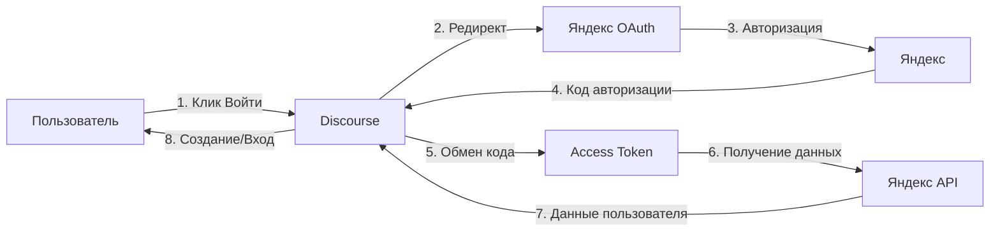

<div align="center">

# 🔐 Yandex ID аутентификация для Discourse

[](https://www.discourse.org/)
[](https://www.ruby-lang.org/)
[](https://oauth.net/2/)
[](LICENSE)

### 🌍 Languages / Языки

[](README.md)
[](README_RU.md)

---

**OAuth2 плагин аутентификации для Discourse через Яндекс ID**

[Возможности](#-возможности) • [Установка](#-установка) • [Настройка](#️-настройка) • [Устранение проблем](#-устранение-проблем) • [Документация](#-документация)

</div>

---

## ⚡ Возможности

<table>
<tr>
<td width="50%">

### 🔐 Безопасность
- **OAuth 2.0** authorization code flow
- Безопасное хранение секретного ключа
- HTTPS обязателен для всех эндпоинтов
- CSRF защита через параметр `state`
- Пароли не хранятся локально

</td>
<td width="50%">

### 🎨 Пользовательский опыт
- Авторизация в один клик через Яндекс
- Автоматическое создание пользователей
- Привязка аккаунта по email
- Импорт аватара из Яндекса
- Бесшовный процесс входа

</td>
</tr>
<tr>
<td width="50%">

### 🛠️ Возможности для разработчиков
- Санитизация и валидация username
- Комплексная обработка ошибок
- Детальное логирование
- Поддержка проверки email
- Двуязычный интерфейс (EN/RU)

</td>
<td width="50%">

### 📚 Простая интеграция
- Простая установка
- Понятная настройка
- Автоматические обновления
- Полная документация
- Активная поддержка

</td>
</tr>
</table>

---

## 📋 Требования

| Компонент | Версия |
|-----------|--------|
|  | 2.8.0 или выше |
|  | 2.7+ |
|  | Приложение зарегистрировано на [oauth.yandex.ru](https://oauth.yandex.ru/client/new) |

---

## 🚀 Установка

### Шаг 1: Установка плагина

Следуйте инструкции [Установка плагина](https://meta.discourse.org/t/install-a-plugin/19157):

```bash
cd /var/discourse
nano containers/app.yml
```

Добавьте в `hooks.after_code`:
```yaml
- git clone https://github.com/kaktaknet/discourse-yandex-oauth.git
```

Или через SSH:
```bash
- git clone git@github.com:kaktaknet/discourse-yandex-oauth.git
```

### Шаг 2: Пересборка контейнера

```bash
cd /var/discourse
./launcher rebuild app
```

**Для разработки:**
```bash
bundle exec rake db:migrate
bundle exec rails server
```

---

## ⚙️ Настройка

### 1. Создание приложения Яндекс OAuth

1. Перейдите на **[Яндекс OAuth](https://oauth.yandex.ru/client/new)**
2. Нажмите **"Создать приложение"**
3. Заполните данные приложения

### 2. Настройка OAuth

**Callback URL:**
```
https://ваш-домен-discourse.com/auth/yandex/callback
```

**Необходимые права доступа:**
- ✅ `login:email` - Доступ к email адресу
- ✅ `login:info` - Доступ к информации профиля
- ✅ `login:avatar` - Доступ к аватару пользователя

### 3. Настройки Discourse

Перейдите в: **Админ → Настройки → Вход → Yandex**

| Настройка | Значение | Описание |
|-----------|----------|----------|
| `yandex_enabled` | ✅ `true` | Включить авторизацию через Яндекс |
| `yandex_client_id` | `a1b2c3d4e5f6...` | OAuth Client ID из Яндекса |
| `yandex_client_secret` | `••••••` | OAuth Client Secret из Яндекса |
| `yandex_email_verified` | ✅ `true` | Доверять проверке email от Яндекса |

---

## 🔄 Как это работает

<div align="center">

### OAuth 2.0 процесс авторизации



</div>

### Маппинг данных пользователя

| Поле Яндекса | Поле Discourse | Обработка |
|--------------|----------------|-----------|
| `id` | `extra_data.yandex_user_id` | Сохраняется для привязки аккаунта |
| `login` | `username` | Санитизируется, проверяется уникальность |
| `default_email` | `email` | Используется для сопоставления аккаунта |
| `first_name` + `last_name` | `name` | Объединяется в полное имя |
| `default_avatar_id` | `avatar_url` | Импортируется если доступен |

### Санитизация username

Плагин обеспечивает валидность username для Discourse:

1. **Фильтрация символов**: Разрешены только `a-z`, `A-Z`, `0-9`, `_`, `-`
2. **Ограничение длины**: Максимум 20 символов
3. **Уникальность**: Добавляется счетчик если username существует (`username_1`, `username_2`, и т.д.)
4. **Резервный вариант**: Генерируется случайный username если санитизация не удалась (`yandex_user_abc123`)

---

## 🏗️ Архитектура

### Структура файлов

```
discourse-yandex-oauth/
├── 📄 plugin.rb                          # Точка входа плагина
├── 📁 lib/
│   └── 🔐 yandex_authenticator.rb       # Основной класс аутентификатора
├── 📁 assets/
│   └── 🎨 images/
│       └── yandex-icon.png              # Иконка кнопки входа
├── 📁 config/
│   ├── ⚙️ settings.yml                   # Настройки плагина
│   └── 🌐 locales/
│       ├── client.en.yml                # Клиентские переводы (EN)
│       ├── client.ru.yml                # Клиентские переводы (RU)
│       ├── server.en.yml                # Серверные переводы (EN)
│       └── server.ru.yml                # Серверные переводы (RU)
├── 📖 README.md                          # Документация (English)
├── 📖 README_RU.md                       # Этот файл
└── 📄 LICENSE                            # MIT лицензия
```

---

## 🔗 Используемые API эндпоинты

| Эндпоинт | Назначение |
|----------|-----------|
| `https://oauth.yandex.ru/authorize` | OAuth авторизация |
| `https://oauth.yandex.ru/token` | Обмен токена |
| `https://login.yandex.ru/info` | Информация о пользователе |
| `https://avatars.yandex.net/get-yapic/{avatar_id}/islands-200` | Аватар пользователя |

---

## 🐛 Устранение проблем

<details>
<summary><b>❌ "Failed to fetch user details from Yandex" (Не удалось получить данные от Яндекса)</b></summary>

**Возможные причины:**
- Невалидный access token
- Проблемы с сетевым подключением
- Временная недоступность API Яндекса

**Решение:**
- Проверьте логи Discourse: `logs/production.log`
- Проверьте OAuth учетные данные
- Попробуйте авторизацию снова
</details>

<details>
<summary><b>❌ "Callback URL mismatch" (Несовпадение callback URL)</b></summary>

**Причина:** Callback URL в приложении Яндекс OAuth не совпадает с фактическим URL

**Решение:**
1. Перейдите на [Яндекс OAuth](https://oauth.yandex.ru)
2. Отредактируйте ваше приложение
3. Установите callback URL: `https://ваш-домен-discourse.com/auth/yandex/callback`
4. Убедитесь что HTTPS совпадает (http vs https)
</details>

<details>
<summary><b>❌ "Invalid client credentials" (Неверные учетные данные клиента)</b></summary>

**Причина:** Неправильный Client ID или Client Secret

**Решение:**
- Перепроверьте учетные данные в приложении Яндекс OAuth
- Убедитесь в отсутствии лишних пробелов при копировании
- Введите учетные данные заново в админ-панели Discourse
</details>

<details>
<summary><b>❌ Кнопка входа не появляется</b></summary>

**Возможные причины:**
- Плагин не включен
- Плагин не загружен
- Проблемы с кэшем

**Решение:**
1. Проверьте что настройка `yandex_enabled` установлена в `true`
2. Перезапустите Discourse: `./launcher rebuild app`
3. Очистите кэш браузера
4. Проверьте консоль браузера на наличие JavaScript ошибок
</details>

---

## 🧪 Разработка

### Запуск тестов

```bash
bundle exec rake plugin:spec[discourse-yandex-oauth]
```

### Логирование

Плагин логирует события авторизации:

```ruby
Rails.logger.error("Yandex API error: HTTP 401")
Rails.logger.error("Yandex connection error: timeout")
```

**Просмотр логов:**

```bash
# Docker
./launcher logs app | grep Yandex

# Разработка
tail -f log/development.log | grep Yandex
```

---

## 📚 Документация

| Документ | Описание |
|----------|----------|
| 📖 [README.md](README.md) | Основная документация (English) |
| 📖 [README_RU.md](README_RU.md) | Документация (Русский) |

---

## 🤝 Поддержка

- **Проблемы**: [GitHub Issues](https://github.com/kaktaknet/discourse-yandex-oauth/issues)
- **Discourse Meta**: [Форум Discourse Meta](https://meta.discourse.org)
- **Документация Яндекс OAuth**: [Официальная документация](https://yandex.ru/dev/id/doc/ru/)

---

## 📄 Лицензия

MIT License - смотрите файл [LICENSE](LICENSE)

---

## 🎉 История изменений

### Версия 1.0.0 (2025-11-08)

#### ✨ Первый релиз
- ✅ OAuth2 авторизация через Яндекс ID
- ✅ Автоматическое создание пользователей и привязка аккаунтов
- ✅ Поддержка проверки email
- ✅ Импорт аватара из Яндекса
- ✅ Санитизация и валидация username
- ✅ Комплексная обработка ошибок
- ✅ Многоязычная поддержка (английский, русский)

---

<div align="center">

**Сделано с ❤️ для сообщества Discourse**

[⬆ Наверх](#-yandex-id-аутентификация-для-discourse)

</div>
